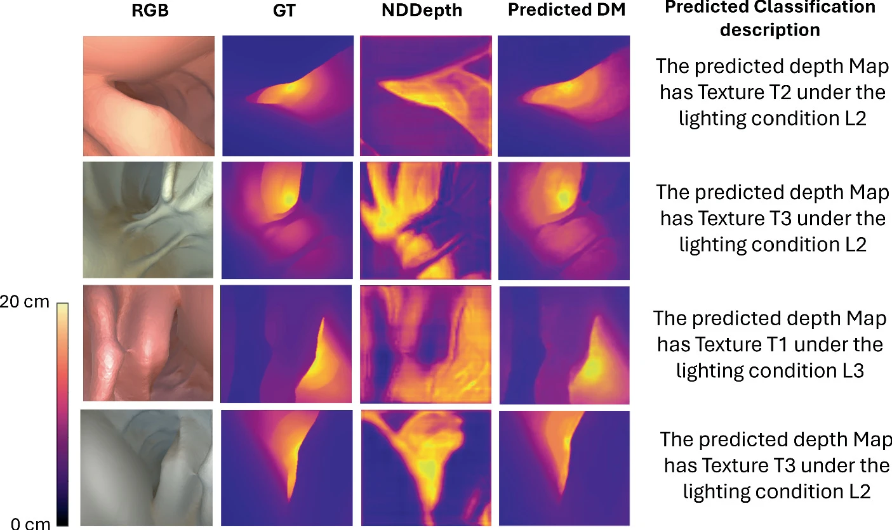
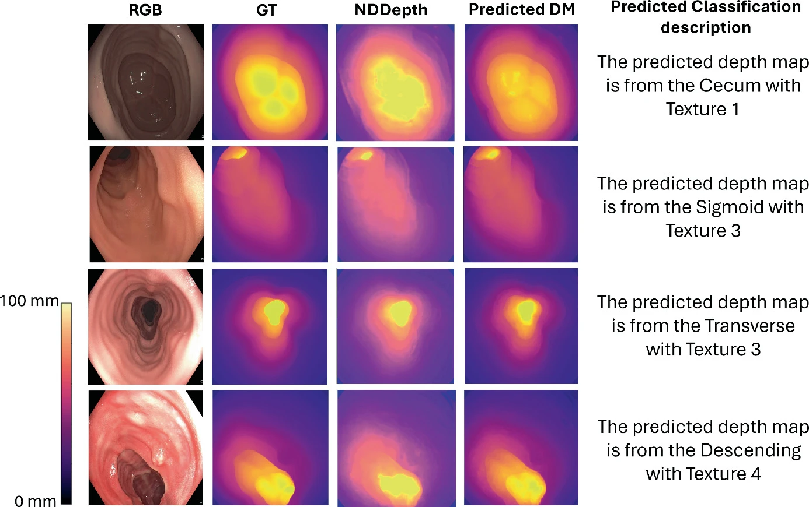

# DepthClassNet
**Official implementation of** *DepthClassNet: A Multitask Framework for Monocular Depth Estimation and Texture Classification in Endoscopic Imaging* (Abdallah & Raza, MIUA 2025).  
[Springer](https://link.springer.com/chapter/10.1007/978-3-031-98691-8_17) • DOI: **10.1007/978-3-031-98691-8_17**

**DepthClassNet** is a multitask framework for **monocular depth estimation** and **texture classification** in **endoscopic (colonoscopy) imaging**. It predicts per-pixel depth from a single RGB frame while classifying tissue texture, improving spatial understanding and scene interpretation for downstream clinical research.  

<p align="center">
  <br>
  <em>DepthClassNet predictions on the UCL dataset</em>
</p>


<p align="center">
  <br>
  <em>DepthClassNet predictions on the UCL dataset</em>
</p>

**Keywords:** monocular depth estimation, depth prediction, endoscopy, colonoscopy, medical imaging, PyTorch, multitask learning, texture classification, Swin Transformer, CLIP
[](LICENSE)


## Environment
- Python **3.11.10** (recommended)  
- PyTorch **≥ 2.2**  
- See **requirements.txt** for full dependencies
  
### Create & activate virtual environment 
python3 -m venv myenv
source myenv/bin/activate  

### Install dependencies
pip install -r requirements.txt


## Datasets

- [UCL colonoscopy dataset](http://cmic.cs.ucl.ac.uk/ColonoscopyDepth/)
- [C3VD](https://durrlab.github.io/C3VD/)


## Checkpoints:
Official pretrained weights can be downloaded here:
[DepthClassNet Checkpoints (OneDrive)](https://livewarwickac-my.sharepoint.com/:u:/g/personal/u2191607_live_warwick_ac_uk/EfUTsqll2CpGkhtK6BP3JdgBTBtmhPZWxF1xldApteRibQ?email=bashayer.q8%40gmail.com&e=bmqgYY)

## License
This repository is licensed under the 
[Creative Commons Attribution-NonCommercial 4.0 International License](https://creativecommons.org/licenses/by-nc/4.0/).

✔ Free for research and educational use.  
❌ Commercial use is not permitted.

## Citation
If you use this code for your research, please cite our paper:
```bibtex
@InProceedings{10.1007/978-3-031-98691-8_17,
  author    = {Abdallah, Bashayer and Raza, Shan E. Ahmed},
  editor    = {Ali, Sharib and Hogg, David C. and Peckham, Michelle},
  title     = {DepthClassNet: A Multitask Framework for Monocular Depth Estimation and Texture Classification in Endoscopic Imaging},
  booktitle = {Medical Image Understanding and Analysis},
  year      = {2026},
  publisher = {Springer Nature Switzerland},
  address   = {Cham},
  pages     = {230--246}
}


